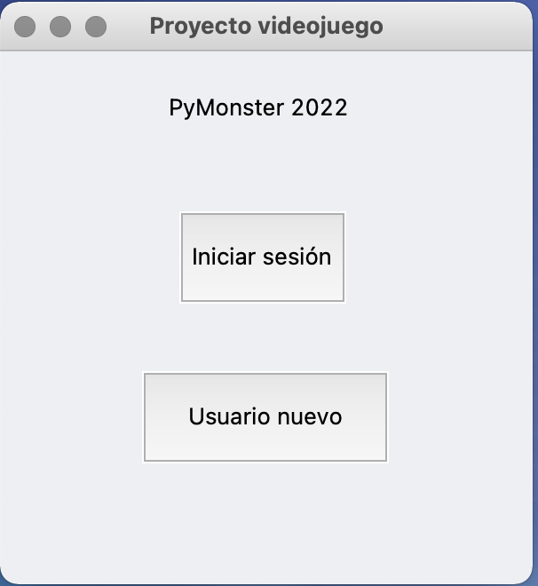

# Videogame PyMonster in Python  

Videojuego tipo RPG desarrollado en Python como parte del proyecto de **programación en python** de AiLab School 2022. Se utilizó la libreria **tkinter** para hacer las ventanas y tiene como opciones para juego la modalidad de entrenamiento y el modo historia, con guardado del juego para poner reiniciar después en el nivel donode te quedaste.

## Requisitos  
```
tkinter
PIL
```

## Ejecución  
```
cd ProyectoAiLab_PythonSubir
python main.py
```

## Resultados  
El juego cumple con todos los requisitos de jugabilidad y validación.  
Algunos de los resultados visuales se presentan a continuación:

### Menú principal  

